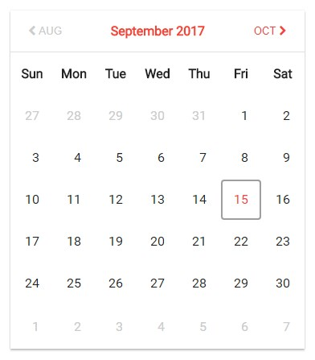

# Calendar

The interactive calendar based on pure Java Script. It has been implemented with the module pattern.

## Getting Started

* Clone this GIT repository
* Go to the created folder and run `index.html`

## Screenshots

